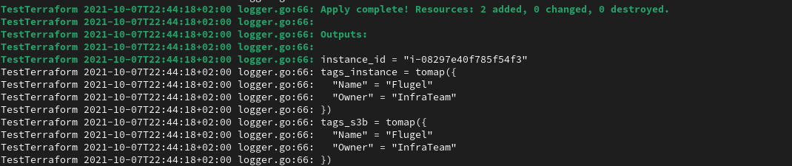
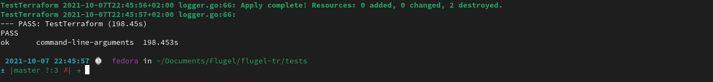
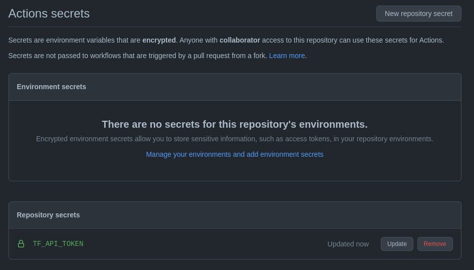
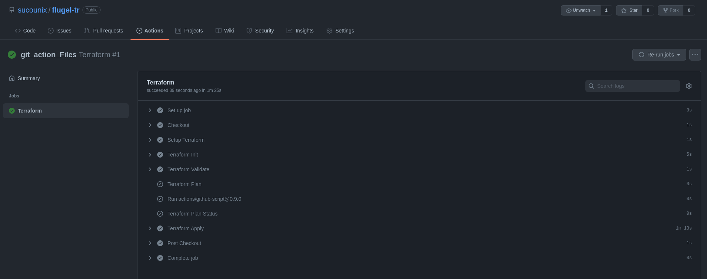
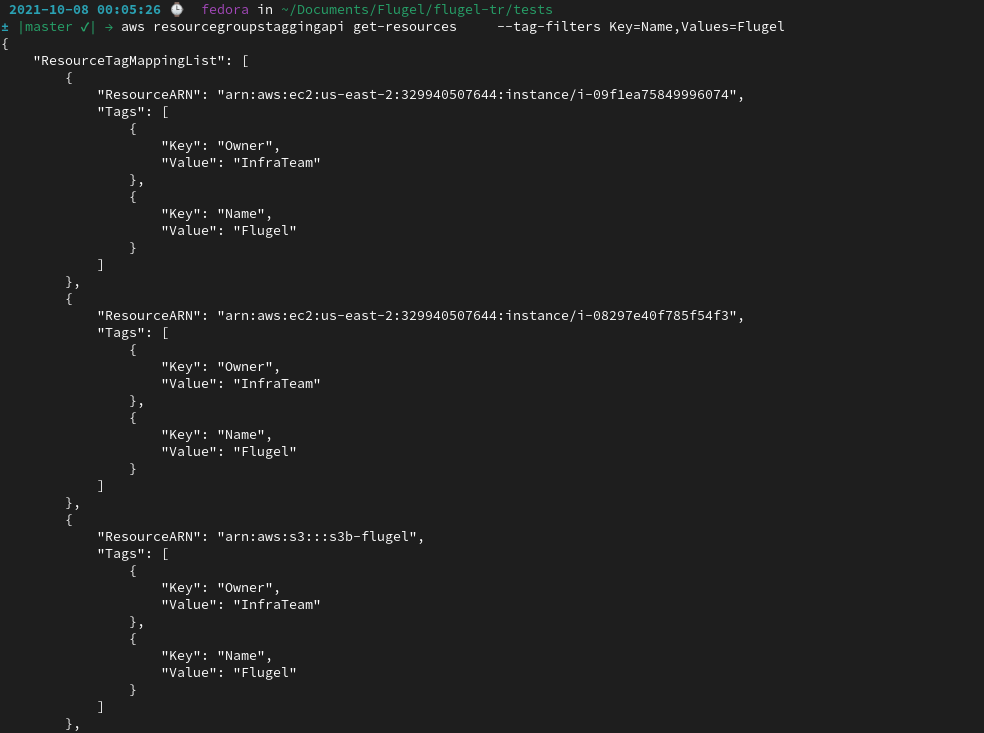
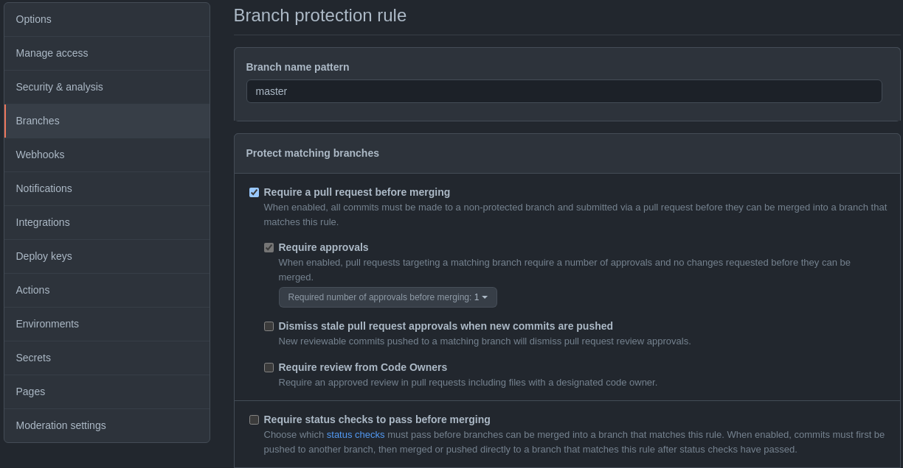
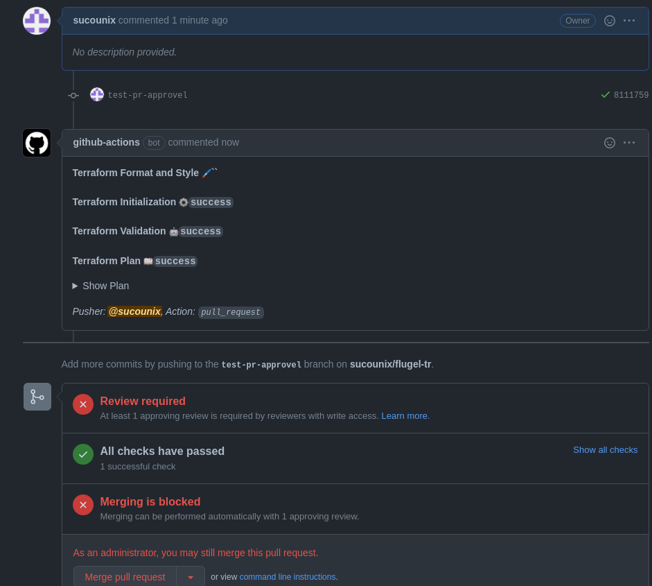
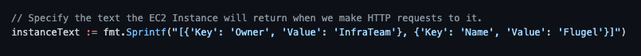
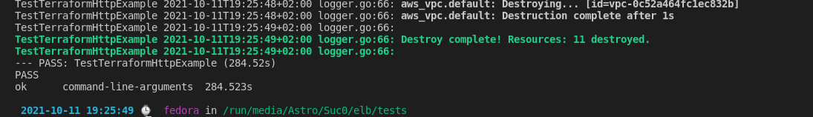
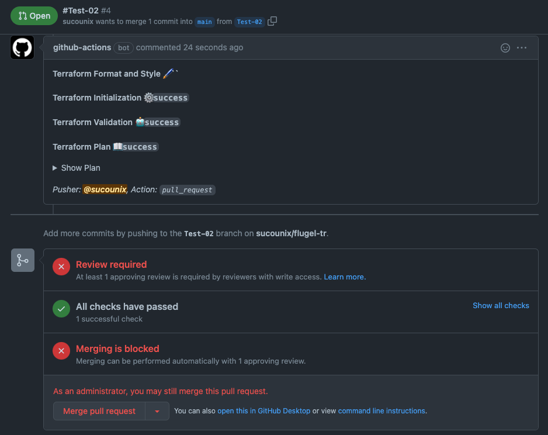

# Flugel Test Documentation

## Documentation for steps to run and test the automation

# #Test-01

### 1 - Local Test Using Terratest (End To End)

1- By runing " tests/go test -v tf_test.go " 

   
   

### 2 - Apply Code Using Github Actions pipeline

1- Set Tokens

   


2- Github Actions pipeline apply results

   

3- AWS resources been created filtered by tag

   

### 3 - configure pull request approval process with code automation checks

 1- Applying pull request approval rule on master

   


 2- Github request approval rule results 

   
   
   
   
# #Test-02

### 1- Cluster of 2 EC2 instances behind an ALB running Nginx with New VPC

```

  # aws_elb.web will be created
  + resource "aws_elb" "web" {
      + arn                         = (known after apply)
      + availability_zones          = (known after apply)
      + connection_draining         = true
      + connection_draining_timeout = 400
      + cross_zone_load_balancing   = true
      + dns_name                    = (known after apply)
      + id                          = (known after apply)
      + idle_timeout                = 400
      + instances                   = (known after apply)
      + internal                    = (known after apply)
      + name                        = "example-elb"
      + security_groups             = (known after apply)
      + source_security_group       = (known after apply)
      + source_security_group_id    = (known after apply)
      + subnets                     = (known after apply)
      + tags_all                    = (known after apply)
      + zone_id                     = (known after apply)

      + health_check {
          + healthy_threshold   = 2
          + interval            = 30
          + target              = "HTTP:80/"
          + timeout             = 3
          + unhealthy_threshold = 2
        }

      + listener {
          + instance_port     = 80
          + instance_protocol = "http"
          + lb_port           = 80
          + lb_protocol       = "http"
        }
    }

  # aws_instance.web[0] will be created
  + resource "aws_instance" "web" {
      + ami                                  = "ami-00399ec92321828f5"
      + arn                                  = (known after apply)
      + associate_public_ip_address          = (known after apply)
      + availability_zone                    = (known after apply)
      + cpu_core_count                       = (known after apply)
      + cpu_threads_per_core                 = (known after apply)
      + disable_api_termination              = (known after apply)
      + ebs_optimized                        = (known after apply)
      + get_password_data                    = false
      + host_id                              = (known after apply)
      + id                                   = (known after apply)
      + instance_initiated_shutdown_behavior = (known after apply)
      + instance_state                       = (known after apply)
      + instance_type                        = "t2.micro"
      + ipv6_address_count                   = (known after apply)
      + ipv6_addresses                       = (known after apply)
      + key_name                             = "10-21-Flugel"
      + monitoring                           = (known after apply)
      + outpost_arn                          = (known after apply)
      + password_data                        = (known after apply)
      + placement_group                      = (known after apply)
      + primary_network_interface_id         = (known after apply)
      + private_dns                          = (known after apply)
      + private_ip                           = (known after apply)
      + public_dns                           = (known after apply)
      + public_ip                            = (known after apply)
      + secondary_private_ips                = (known after apply)
      + security_groups                      = (known after apply)
      + source_dest_check                    = true
      + subnet_id                            = (known after apply)
      + tags                                 = {
          + "Name"  = "Flugel"
          + "Owner" = "InfraTeam"
        }
      + tags_all                             = {
          + "Name"  = "Flugel"
          + "Owner" = "InfraTeam"
        }
      + tenancy                              = (known after apply)
      + user_data                            = "d2a1c0e9f78b09799170f1d6b98a16f2bd74afc4"
      + user_data_base64                     = (known after apply)
      + vpc_security_group_ids               = (known after apply)

      + capacity_reservation_specification {
          + capacity_reservation_preference = (known after apply)

          + capacity_reservation_target {
              + capacity_reservation_id = (known after apply)
            }
        }

      + ebs_block_device {
          + delete_on_termination = (known after apply)
          + device_name           = (known after apply)
          + encrypted             = (known after apply)
          + iops                  = (known after apply)
          + kms_key_id            = (known after apply)
          + snapshot_id           = (known after apply)
          + tags                  = (known after apply)
          + throughput            = (known after apply)
          + volume_id             = (known after apply)
          + volume_size           = (known after apply)
          + volume_type           = (known after apply)
        }

      + enclave_options {
          + enabled = (known after apply)
        }

      + ephemeral_block_device {
          + device_name  = (known after apply)
          + no_device    = (known after apply)
          + virtual_name = (known after apply)
        }

      + metadata_options {
          + http_endpoint               = (known after apply)
          + http_put_response_hop_limit = (known after apply)
          + http_tokens                 = (known after apply)
        }

      + network_interface {
          + delete_on_termination = (known after apply)
          + device_index          = (known after apply)
          + network_interface_id  = (known after apply)
        }

      + root_block_device {
          + delete_on_termination = (known after apply)
          + device_name           = (known after apply)
          + encrypted             = (known after apply)
          + iops                  = (known after apply)
          + kms_key_id            = (known after apply)
          + tags                  = (known after apply)
          + throughput            = (known after apply)
          + volume_id             = (known after apply)
          + volume_size           = (known after apply)
          + volume_type           = (known after apply)
        }
    }

  # aws_instance.web[1] will be created
  + resource "aws_instance" "web" {
      + ami                                  = "ami-00399ec92321828f5"
      + arn                                  = (known after apply)
      + associate_public_ip_address          = (known after apply)
      + availability_zone                    = (known after apply)
      + cpu_core_count                       = (known after apply)
      + cpu_threads_per_core                 = (known after apply)
      + disable_api_termination              = (known after apply)
      + ebs_optimized                        = (known after apply)
      + get_password_data                    = false
      + host_id                              = (known after apply)
      + id                                   = (known after apply)
      + instance_initiated_shutdown_behavior = (known after apply)
      + instance_state                       = (known after apply)
      + instance_type                        = "t2.micro"
      + ipv6_address_count                   = (known after apply)
      + ipv6_addresses                       = (known after apply)
      + key_name                             = "10-21-Flugel"
      + monitoring                           = (known after apply)
      + outpost_arn                          = (known after apply)
      + password_data                        = (known after apply)
      + placement_group                      = (known after apply)
      + primary_network_interface_id         = (known after apply)
      + private_dns                          = (known after apply)
      + private_ip                           = (known after apply)
      + public_dns                           = (known after apply)
      + public_ip                            = (known after apply)
      + secondary_private_ips                = (known after apply)
      + security_groups                      = (known after apply)
      + source_dest_check                    = true
      + subnet_id                            = (known after apply)
      + tags                                 = {
          + "Name"  = "Flugel"
          + "Owner" = "InfraTeam"
        }
      + tags_all                             = {
          + "Name"  = "Flugel"
          + "Owner" = "InfraTeam"
        }
      + tenancy                              = (known after apply)
      + user_data                            = "d2a1c0e9f78b09799170f1d6b98a16f2bd74afc4"
      + user_data_base64                     = (known after apply)
      + vpc_security_group_ids               = (known after apply)

      + capacity_reservation_specification {
          + capacity_reservation_preference = (known after apply)

          + capacity_reservation_target {
              + capacity_reservation_id = (known after apply)
            }
        }

      + ebs_block_device {
          + delete_on_termination = (known after apply)
          + device_name           = (known after apply)
          + encrypted             = (known after apply)
          + iops                  = (known after apply)
          + kms_key_id            = (known after apply)
          + snapshot_id           = (known after apply)
          + tags                  = (known after apply)
          + throughput            = (known after apply)
          + volume_id             = (known after apply)
          + volume_size           = (known after apply)
          + volume_type           = (known after apply)
        }

      + enclave_options {
          + enabled = (known after apply)
        }

      + ephemeral_block_device {
          + device_name  = (known after apply)
          + no_device    = (known after apply)
          + virtual_name = (known after apply)
        }

      + metadata_options {
          + http_endpoint               = (known after apply)
          + http_put_response_hop_limit = (known after apply)
          + http_tokens                 = (known after apply)
        }

      + network_interface {
          + delete_on_termination = (known after apply)
          + device_index          = (known after apply)
          + network_interface_id  = (known after apply)
        }

      + root_block_device {
          + delete_on_termination = (known after apply)
          + device_name           = (known after apply)
          + encrypted             = (known after apply)
          + iops                  = (known after apply)
          + kms_key_id            = (known after apply)
          + tags                  = (known after apply)
          + throughput            = (known after apply)
          + volume_id             = (known after apply)
          + volume_size           = (known after apply)
          + volume_type           = (known after apply)
        }
    }

  # aws_internet_gateway.gw will be created
  + resource "aws_internet_gateway" "gw" {
      + arn      = (known after apply)
      + id       = (known after apply)
      + owner_id = (known after apply)
      + tags     = {
          + "Name" = "tf_test_ig"
        }
      + tags_all = {
          + "Name" = "tf_test_ig"
        }
      + vpc_id   = (known after apply)
    }

  # aws_lb_cookie_stickiness_policy.default will be created
  + resource "aws_lb_cookie_stickiness_policy" "default" {
      + cookie_expiration_period = 600
      + id                       = (known after apply)
      + lb_port                  = 80
      + load_balancer            = (known after apply)
      + name                     = "lbpolicy"
    }

  # aws_route_table.r will be created
  + resource "aws_route_table" "r" {
      + arn              = (known after apply)
      + id               = (known after apply)
      + owner_id         = (known after apply)
      + propagating_vgws = (known after apply)
      + route            = [
          + {
              + carrier_gateway_id         = ""
              + cidr_block                 = "0.0.0.0/0"
              + destination_prefix_list_id = ""
              + egress_only_gateway_id     = ""
              + gateway_id                 = (known after apply)
              + instance_id                = ""
              + ipv6_cidr_block            = ""
              + local_gateway_id           = ""
              + nat_gateway_id             = ""
              + network_interface_id       = ""
              + transit_gateway_id         = ""
              + vpc_endpoint_id            = ""
              + vpc_peering_connection_id  = ""
            },
        ]
      + tags             = {
          + "Name" = "aws_route_table"
        }
      + tags_all         = {
          + "Name" = "aws_route_table"
        }
      + vpc_id           = (known after apply)
    }

  # aws_route_table_association.a will be created
  + resource "aws_route_table_association" "a" {
      + id             = (known after apply)
      + route_table_id = (known after apply)
      + subnet_id      = (known after apply)
    }

  # aws_security_group.default will be created
  + resource "aws_security_group" "default" {
      + arn                    = (known after apply)
      + description            = "Used in the terraform"
      + egress                 = [
          + {
              + cidr_blocks      = [
                  + "0.0.0.0/0",
                ]
              + description      = ""
              + from_port        = 0
              + ipv6_cidr_blocks = []
              + prefix_list_ids  = []
              + protocol         = "-1"
              + security_groups  = []
              + self             = false
              + to_port          = 0
            },
        ]
      + id                     = (known after apply)
      + ingress                = [
          + {
              + cidr_blocks      = [
                  + "0.0.0.0/0",
                ]
              + description      = ""
              + from_port        = 22
              + ipv6_cidr_blocks = []
              + prefix_list_ids  = []
              + protocol         = "tcp"
              + security_groups  = []
              + self             = false
              + to_port          = 22
            },
          + {
              + cidr_blocks      = [
                  + "0.0.0.0/0",
                ]
              + description      = ""
              + from_port        = 80
              + ipv6_cidr_blocks = []
              + prefix_list_ids  = []
              + protocol         = "tcp"
              + security_groups  = []
              + self             = false
              + to_port          = 80
            },
        ]
      + name                   = "instance_sg"
      + name_prefix            = (known after apply)
      + owner_id               = (known after apply)
      + revoke_rules_on_delete = false
      + tags_all               = (known after apply)
      + vpc_id                 = (known after apply)
    }

  # aws_security_group.elb will be created
  + resource "aws_security_group" "elb" {
      + arn                    = (known after apply)
      + description            = "Used in the terraform"
      + egress                 = [
          + {
              + cidr_blocks      = [
                  + "0.0.0.0/0",
                ]
              + description      = ""
              + from_port        = 0
              + ipv6_cidr_blocks = []
              + prefix_list_ids  = []
              + protocol         = "-1"
              + security_groups  = []
              + self             = false
              + to_port          = 0
            },
        ]
      + id                     = (known after apply)
      + ingress                = [
          + {
              + cidr_blocks      = [
                  + "0.0.0.0/0",
                ]
              + description      = ""
              + from_port        = 80
              + ipv6_cidr_blocks = []
              + prefix_list_ids  = []
              + protocol         = "tcp"
              + security_groups  = []
              + self             = false
              + to_port          = 80
            },
        ]
      + name                   = "elb_sg"
      + name_prefix            = (known after apply)
      + owner_id               = (known after apply)
      + revoke_rules_on_delete = false
      + tags_all               = (known after apply)
      + vpc_id                 = (known after apply)
    }

  # aws_subnet.tf_test_subnet will be created
  + resource "aws_subnet" "tf_test_subnet" {
      + arn                             = (known after apply)
      + assign_ipv6_address_on_creation = false
      + availability_zone               = (known after apply)
      + availability_zone_id            = (known after apply)
      + cidr_block                      = "10.0.0.0/24"
      + id                              = (known after apply)
      + ipv6_cidr_block_association_id  = (known after apply)
      + map_public_ip_on_launch         = true
      + owner_id                        = (known after apply)
      + tags                            = {
          + "Name" = "tf_test_subnet"
        }
      + tags_all                        = {
          + "Name" = "tf_test_subnet"
        }
      + vpc_id                          = (known after apply)
    }

  # aws_vpc.default will be created
  + resource "aws_vpc" "default" {
      + arn                              = (known after apply)
      + assign_generated_ipv6_cidr_block = false
      + cidr_block                       = "10.0.0.0/16"
      + default_network_acl_id           = (known after apply)
      + default_route_table_id           = (known after apply)
      + default_security_group_id        = (known after apply)
      + dhcp_options_id                  = (known after apply)
      + enable_classiclink               = (known after apply)
      + enable_classiclink_dns_support   = (known after apply)
      + enable_dns_hostnames             = true
      + enable_dns_support               = true
      + id                               = (known after apply)
      + instance_tenancy                 = "default"
      + ipv6_association_id              = (known after apply)
      + ipv6_cidr_block                  = (known after apply)
      + main_route_table_id              = (known after apply)
      + owner_id                         = (known after apply)
      + tags                             = {
          + "Name" = "tf_test"
        }
      + tags_all                         = {
          + "Name" = "tf_test"
        }
    }

Plan: 11 to add, 0 to change, 0 to destroy.

Changes to Outputs:
  + instance_url = (known after apply)
```

### 2 - Local Test Using Terratest_HttpGet (End To End)


1- By runing " ./test_run.sh "








 ### 3 - PR with code and updated documentation for the new requirement
 
  
 
 ***Done***

Test-02